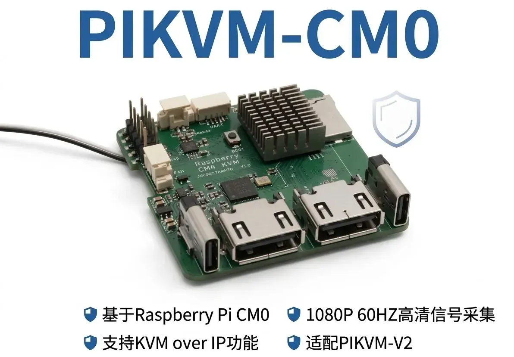

[简体中文](README.md) | [English](README_en.md)

# PIKVM-CM0

One-click deployment of PiKVM to Raspberry Pi CM0 + TC358743 HDMI capture card

## Project showcase



[Hardware project and image source](https://oshwhub.com/jasonyang17/rbpi-kvm)

## Video optimization for existing devices

If you have already installed it, please read [Optimization and Rollback Instructions](docs/optimizations.md) first, no need to reinstall the system:

```bash
git clone https://github.com/JasonYANG170/pikvm-cm0.git
cd pikvm-cm0
sudo bash scripts/install-webrtc.sh       # 可选，适配 Janus 1.1.2 / uStreamer 5.37
sudo bash scripts/apply-optimizations.sh
```

Includes automatic HDMI timing, 1080p50 EDID, hardware encoding, automatic frame rate, Wi-Fi power saving off, and H.264/WebRTC.
The desktop and accounts are retained; log in again after restarting the video service. Testing at 1024×768 measured approximately 60 fps on the device itself; this does not establish 1080p performance or the actual browser frame rate.

## Hardware requirements

| Components | Model |
|------|------|
| Single Board Computer | Raspberry Pi CM0 |
| HDMI capture | TC358743 HDMI-to-CSI |
| USB OTG | USB-C OTG cable |
| Storage | 16GB |
| Power supply | USB-C 5V/3A power supply |


## Rapid deployment

### 1. Prepare system image

1. Download [Raspberry Pi OS Lite (64-bit)](https://www.raspberrypi.com/software/operating-systems/)
2. Use [Raspberry Pi Imager](https://www.raspberrypi.com/software/) to write the image to an SD card
3. Preconfigure in Imager:
   - Enable SSH
   - Set username and password (such as `rbpi-kvm` / `rbpi-kvm`)
   - Configure WiFi (optional)

### 2. First startup

1. Insert the SD card and connect the HDMI capture card and OTG cable
2. Power on and wait for the system to boot
3. SSH to the Raspberry Pi:
   ```bash
   ssh rbpi-kvm@<树莓派IP>
   ```

### 3. One-click deployment

```bash
# 下载完整仓库（部署脚本依赖 configs、scripts、systemd 和 edid）
git clone https://github.com/JasonYANG170/pikvm-cm0.git
cd pikvm-cm0
chmod +x deploy.sh

# 运行部署（约 30-60 分钟）
sudo ./deploy.sh
```

### 4. Access PiKVM

After deployment, open the following address in a browser:
```
https://<树莓派IP>
```

Default login:
- Username: `admin`
- Password: `admin`

## Manual deployment

If the automated script is not suitable, you can perform the following steps manually:

### Step 1: Update your system

```bash
sudo apt update && sudo apt upgrade -y
```

### Step 2: Install dependencies

```bash
sudo apt install -y git wget build-essential cmake \
  libsystemd-dev libjpeg62-turbo libgpiod-dev \
  nginx iptables tesseract-ocr tesseract-ocr-eng \
  python3-dev python3-pip python3-setuptools
```

### Step 3: Compile and install Python 3.10

```bash
cd /tmp
wget https://www.python.org/ftp/python/3.10.9/Python-3.10.9.tgz
tar xzf Python-3.10.9.tgz
cd Python-3.10.9
./configure --prefix=/usr/local
make -j$(nproc)
sudo make install
```

### Step 4: Install fruity-pikvm

```bash
cd /tmp
git clone https://github.com/jacobbar/fruity-pikvm.git
cd fruity-pikvm
sudo ./install.sh
```

### Step 5: Fix compatibility issues

```bash
# 运行修复脚本
sudo ./scripts/fix-compat.sh
```

### Step 6: Apply Configuration

```bash
sudo cp configs/override.yaml /etc/kvmd/override.yaml
sudo cp edid/tc358743-edid.hex /etc/kvmd/tc358743-edid.hex
sudo cp scripts/kvmd-setup.sh /usr/local/bin/kvmd-setup.sh
sudo chmod +x /usr/local/bin/kvmd-setup.sh
sudo cp systemd/kvmd-setup.service /etc/systemd/system/
sudo systemctl daemon-reload
sudo systemctl enable kvmd-setup kvmd kvmd-nginx kvmd-webterm
```

### Step 7: Configure OTG

```bash
# 编辑 /boot/firmware/config.txt，确保有以下内容：
# [all]
# dtoverlay=dwc2,dr_mode=otg
# dtoverlay=tc358743

sudo reboot
```

## Configuration instructions

### override.yaml

```yaml
kvmd:
    msd:
        type: disabled           # MSD 功能（需要额外分区）
    gpio:
        drivers: {}              # GPIO 驱动
        scheme: {}               # GPIO 方案
    hid:
        mouse_alt:
            device: /dev/kvmd-hid-mouse-alt  # 启用双鼠标模式
    streamer:
        resolution:
            default: 1920x1080       # 实际采集自动跟随 HDMI 源
        desired_fps:
            default: 0               # 自动帧率
        cmd:
            - "/usr/bin/ustreamer"
            - "--device=/dev/kvmd-video"
            - "--format=uyvy"    # TC358743 输出格式
            - "--dv-timings"
            - "--encoder=M2M-VIDEO"
            # ... 其他参数
```

### kvmd-setup.sh

Automatically executed on startup:
- Create `/dev/kvmd-video` symbolic link
- Set EDID
- uStreamer continuously follows DV timings, allowing the source device to start later
- Fix permissions

### boot/config.txt

```ini
[all]
dtoverlay=dwc2,dr_mode=otg    # USB OTG 设备模式
dtoverlay=tc358743             # TC358743 HDMI 采集驱动
enable_uart=1                  # 启用串口
```

## Known issues and solutions

### 1. Black screen / NO SIGNAL

**Cause**: EDID is not set or HDMI source device does not output signal

**Solution**:
```bash
sudo systemctl stop kvmd
sudo /usr/local/bin/kvmd-setup.sh
sudo systemctl restart kvmd
```

### 2. Resolution display 640x480

**Cause**: DV timings are not set correctly

**Solution**:
```bash
v4l2-ctl --device /dev/video0 --query-dv-timings
# 使用 scripts/apply-optimizations.sh 启用 --dv-timings 自动同步。
```

### 3. Mouse and keyboard unresponsive

**Cause**: USB OTG connection problem

**Checks**:
```bash
# 在被控设备上运行 lsusb，应看到 PiKVM 设备
lsusb | grep -i pikvm

# 检查 HID 设备
ls -la /dev/hidg*

# 测试写入
sudo sh -c 'echo -ne "\x00\x00\x04\x00\x00\x00\x00\x00" > /dev/hidg0'
```

**Solution**:
- Make sure to use an OTG cable (not a charging cable)
- Confirm connection to the USB-C port of the Raspberry Pi
- Try other USB ports of the controlled device

### 4. Switch mouse mode

Click the **System** menu in the web interface to switch:
- **Absolute**: Absolute positioning (default, suitable for desktop systems)
- **Relative**: relative positioning (suitable for BIOS/UEFI)

### 5. libjpeg.so.8 is missing

```bash
# 从源码编译 libjpeg-turbo（带 JPEG8 ABI）
cd /tmp
wget https://github.com/libjpeg-turbo/libjpeg-turbo/archive/refs/tags/2.1.5.tar.gz
tar xzf 2.1.5.tar.gz
cd libjpeg-turbo-2.1.5
mkdir build && cd build
cmake -DCMAKE_INSTALL_PREFIX=/usr -DWITH_JPEG8=1 ..
make -j$(nproc)
sudo make install
sudo ldconfig
```

### 6. libgpiod.so.2 is missing

```bash
# 从源码编译 libgpiod 1.6.x
cd /tmp
wget https://mirrors.edge.kernel.org/pub/software/libs/libgpiod/libgpiod-1.6.4.tar.xz
tar xf libgpiod-1.6.4.tar.xz
cd libgpiod-1.6.4
./configure --prefix=/usr --enable-tools=no --enable-tests=no --disable-bindings
make -j$(nproc)
sudo make install
sudo ldconfig
```

## File structure

```
fruity-pikvm-deploy/
├── README.md              # 本文档
├── deploy.sh              # 一键部署脚本
├── configs/
│   ├── override.yaml      # kvmd 配置
│   └── boot-config.txt    # 树莓派启动配置
├── scripts/
│   ├── kvmd-setup.sh      # 启动脚本
│   └── fix-compat.sh      # 兼容性修复脚本
├── systemd/
│   └── kvmd-setup.service # systemd 服务
└── edid/
    ├── v2-hdmi.hex        # PiKVM V2 EDID
    └── tc358743-edid.hex  # TC358743 EDID
```

## License

This project is based on fruity-pikvm and PiKVM open source projects.

- [fruity-pikvm](https://github.com/jacobbar/fruity-pikvm) - GPLv3
- [PiKVM](https://github.com/pikvm/pikvm) - GPLv3
- [ustreamer](https://github.com/pikvm/ustreamer) - GPLv3

